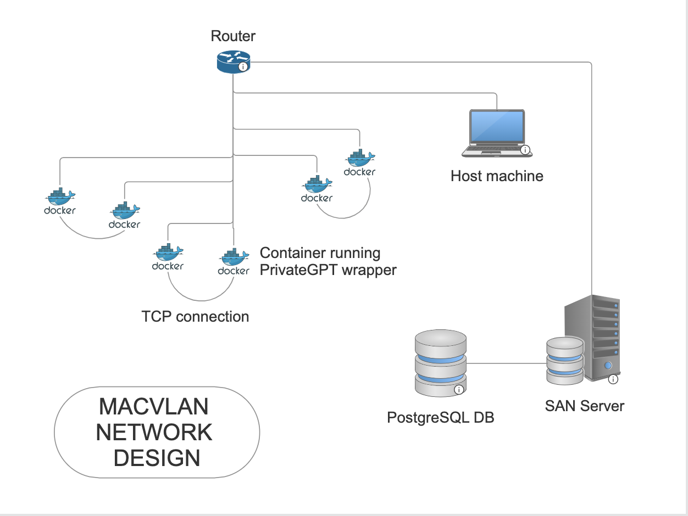

# Chatterbox
Virtual network of chatters

A local network that spins up pairs of containers to "chat" using 
PrivateGPT. Optionally, stores conversations in a shared database. 

## DESIGN

TO DO

- [ ] Get two containers talking to each other over TCP
- [ ] Write a turn based chat app wrapper for PrivateGPT
- [ ] Implement a shared database
