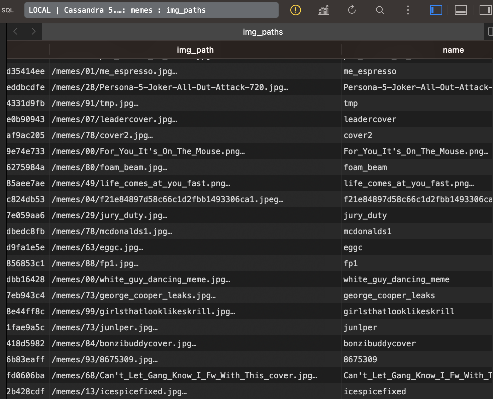
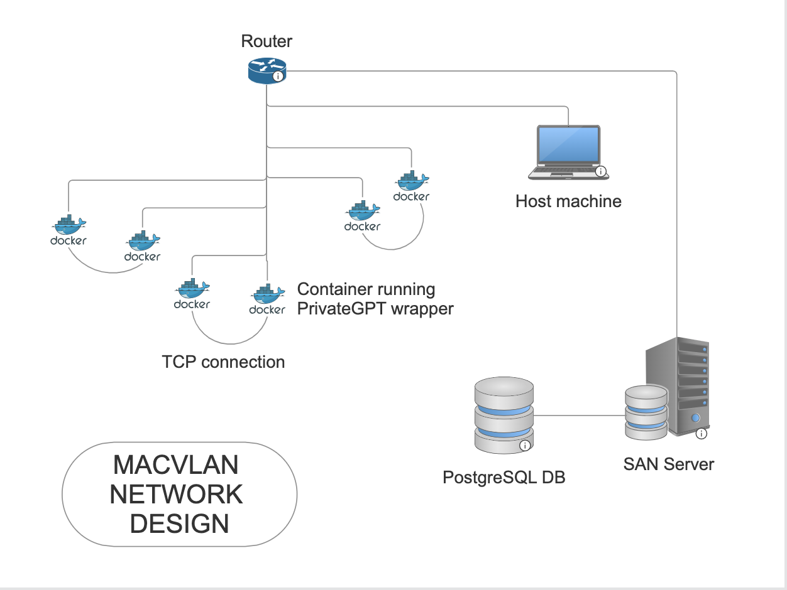

# --Chatterbox-- Now MemeStore
Virtual network of chatters

A distributed meme storage solution with High Availability using 
Cassandra. 



TODO:
 
- [ ] Create a chat app where a client chooses a recipient and chooses a meme. 
- [ ] Store chats in a container db


## DESIGN

![Alt text] (Rough network design)


### Setting up Docker Network

This configuration uses a MACVLAN so that the host computer can also 
connect to another container for a chat, or to the database. Importantly, 
MACVLAN only works properly on Linux, because MacOS runs Docker in a VM, 
so there is an internet interface mismatch. You could run this on mac by 
using a bridge or host network instead, but rememmber to expose the ports of your database server so that 
your host mmachine can access conversations.

```
docker network create -d macvlan \ 
--subnet=192.168.1.0/24 \
--ip-range=192.168.1.128/25 \
--gateway=192.168.1.1 \
-o parent=eth0 chatterbox-network
```
